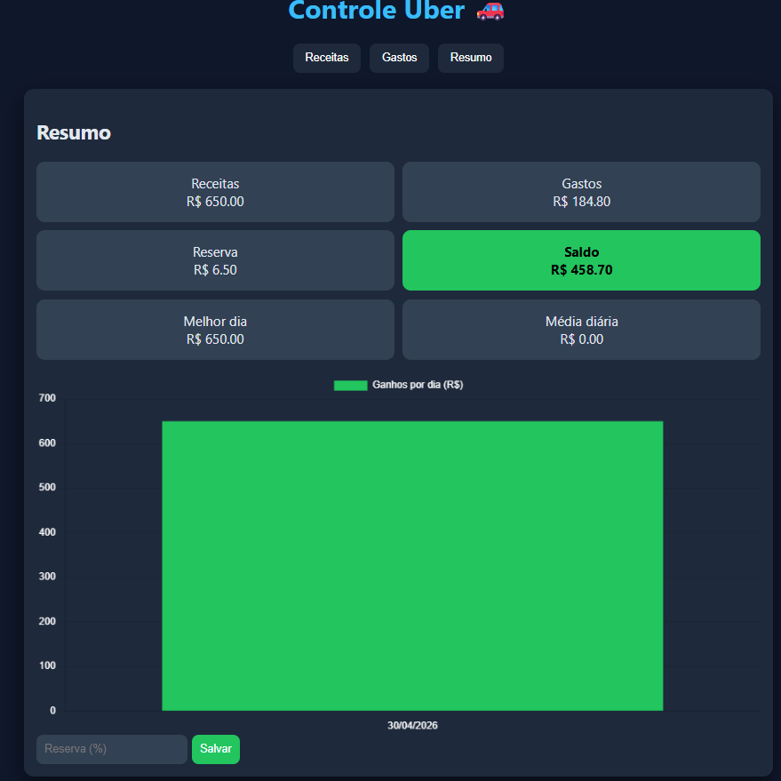

# 💰 Controle Financeiro para Motoristas de Aplicativo

Aplicação web desenvolvida para auxiliar motoristas de aplicativo no controle financeiro diário, permitindo análise de ganhos, despesas e saldo de forma simples e visual.

## 🔧 Funcionalidades

- Registro de receitas e despesas
- Filtro por período (data inicial e final)
- Dashboard com visualização em gráfico
- Cálculo automático de saldo e reserva financeira
- Persistência de dados com LocalStorage

## 🛠 Tecnologias

- JavaScript (ES6+)
- HTML5
- CSS3
- Chart.js
- LocalStorage
- Git e GitHub

## 📸 Preview

## 🎯 Objetivo do Projeto

Projeto desenvolvido com foco em prática real de desenvolvimento web, aplicando conceitos de manipulação de DOM, armazenamento local e visualização de dados.

## 🚀 Como usar

1. Faça o download ou clone este repositório
2. Abra o arquivo `index.html` no navegador
3. Utilize o sistema para registrar receitas e despesas
