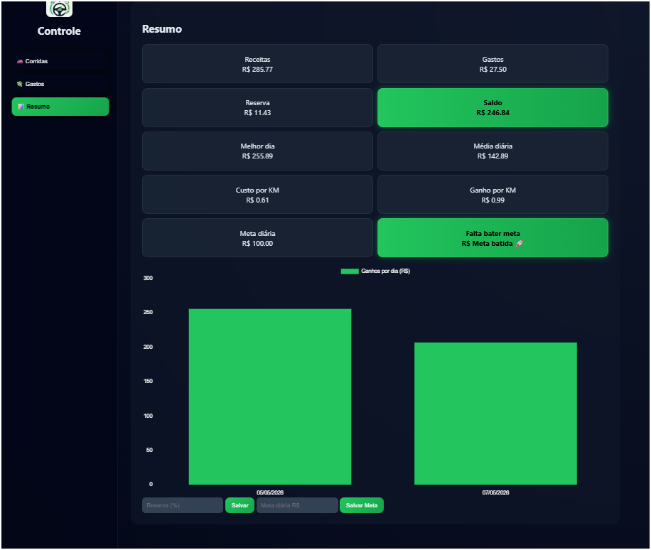

🚗 Controle Financeiro para Motoristas

Sistema web inteligente para motoristas de aplicativo com suporte a:

🚗 Gasolina
🚙 GNV
⚡ Veículos Elétricos

## 📸 Preview

🔥 Funcionalidades
✅ Cadastro de receitas
✅ Controle de gastos
✅ Dashboard financeiro
✅ Metas diárias
✅ Firebase Realtime
✅ Login com Google
✅ Sincronização em tempo real
✅ PWA instalável no celular
✅ Sistema responsivo
🚀 Tecnologias utilizadas
HTML5
CSS3
JavaScript
Firebase Authentication
Firestore Database
Firebase Hosting
PWA
🌎 Aplicação Online

https://controle-corridas-90795.web.app

📱 Funcionalidades do App

O sistema permite ao motorista:

acompanhar ganhos diários
controlar despesas
visualizar lucro líquido
acompanhar metas
acessar pelo celular ou computador
sincronização em tempo real
🔥 Diferenciais do Projeto
Aplicação em nuvem
Deploy em produção
Banco de dados realtime
Multiusuário
Autenticação Google
Interface moderna
Instalável como aplicativo Android
👨‍💻 Desenvolvedor

Antônio Linhares

GitHub:
https://github.com/Ajrdidi1980
